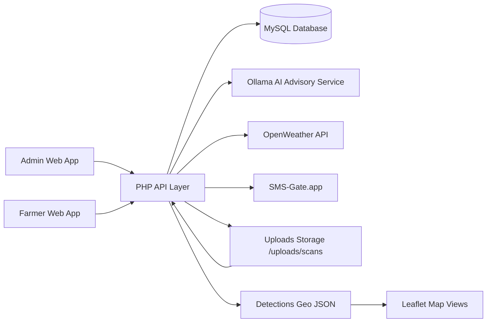

# RiceGuard Backend Architecture

## Scope Update

This backend architecture reflects the current implementation direction of RiceGuard as of April 28, 2026:

- `Frontend client`: web application
- `Map engine`: Leaflet
- `Map tiles`: provider-agnostic (`OpenStreetMap` / imagery tiles in the frontend)
- `Backend`: PHP REST-style API on XAMPP
- `Database`: MySQL
- `AI advisory provider`: Ollama cloud (`qwen3.5:397b-cloud`)
- `Weather enrichment`: OpenWeather API
- `SMS delivery`: SMS-Gate.app

Important study note:

- The original draft mentions a `mobile application`, `Google Maps`, and a `Firebase/GCP serverless pipeline`.
- The running codebase is now better described as a `web-based platform with a PHP/MySQL backend and Leaflet-based geospatial visualization`.
- The backend is intentionally `map-provider agnostic`: it returns latitude/longitude, severity, disease, and metadata; the frontend decides how to render them in Leaflet.

The frontend design was intentionally not changed in this backend pass.

## High-Level Architecture

## Backend Layers

### 1. API Layer

The PHP API is the entry point for both admin and farmer clients.

- `auth.php`: registration, OTP login, verification, logout, session validation
- `upload_scan.php`: scan ingestion for web uploads, manual detections, mock inference, and future external model callbacks
- `get_detections.php`: map-ready disease records for admin and farmer views
- `send_advisory.php`: admin-generated or AI-assisted advisories plus SMS sending
- `ai_expert.php` and `ai_chat.php`: advisory generation endpoints
- `weather.php`: weather context for farmer dashboards and advisory enrichment
- `dashboard_stats.php`, `get_alerts.php`, `get_notifications.php`, `farmer.php`: operational dashboard and farmer-facing support endpoints

### 2. Authentication and Access Control

Authentication is token-based and suited to a web frontend.

- OTP verification uses `otp_codes`
- sessions are stored in `sessions`
- role checks distinguish `admin` vs `farmer`
- protected endpoints use `requireAuth()` and `requireAdmin()`
- `login_audit` supports OTP rate limiting and auditability

### 3. Scan Ingestion Layer

The backend now supports a more complete web ingestion flow.

- Accepts `multipart/form-data` image uploads
- Accepts JSON-only detection payloads for manual or external inference use
- Stores uploaded scan files under `uploads/scans/`
- Stores scan metadata such as:
  - `scan_name`
  - `source_type`
  - `original_filename`
  - `stored_path`
  - `mime_type`
  - `file_size_bytes`
  - `captured_at`
  - `processed_at`
  - `notes`
  - `status`

This makes the backend usable for:

- actual web uploads
- manual encoded detections
- mock/demo scans
- future Python YOLO inference integration

### 4. Disease Detection and Geospatial Layer

The disease mapping layer is now designed around generic geospatial output rather than Google Maps-specific output.

Each detection can store:

- `disease`
- `severity`
- `location_text`
- `latitude`
- `longitude`
- `confidence_score`
- `affected_area_pct`
- `bbox_json`
- `mask_path`
- `meta_json`
- `image_url`

This allows Leaflet to render:

- pin markers
- popups
- severity colors
- optional future overlays such as polygons or segmentation masks

### 5. Advisory Generation Layer

The advisory subsystem is split into two practical modes:

- `field_advisory`: longer admin-facing recommendation draft
- `sms_draft`: short farmer-friendly draft

Current behavior:

- provider-aware AI client now supports Ollama cloud
- weather context can be injected into prompts
- disease normalization is built in for:
  - Rice Blast
  - Bacterial Leaf Blight
  - Tungro
- fallback rule-based guidance is returned when the AI provider is unavailable

This keeps the system operational even when the external model fails.

### 6. Notification Layer

SMS notification remains admin-controlled rather than scan-triggered.

- `send_advisory.php` stores approved advisories
- SMS content is formatted from approved advice
- `alert_history` records delivery status
- `notification_preferences` lets farmer preferences influence sending

This is closer to the study workflow because disease detection is separated from advisory approval and communication.

## Data Model

### Core tables

- `farmers`
- `otp_codes`
- `sessions`
- `login_audit`
- `notification_preferences`

### Operational tables

- `drone_scans`
- `disease_detections`
- `advisories`
- `alert_history`

## API Contract Summary

### Admin-side flow

1. Admin authenticates via `auth.php`
2. Admin uploads a scan or detection payload via `upload_scan.php`
3. Backend creates a `drone_scans` record
4. Backend stores one or more `disease_detections`
5. Admin reviews detections from `get_detections.php`
6. Admin requests AI draft via `send_advisory.php` with `action=ai_compose`
7. Admin approves and sends advisory via `send_advisory.php` with `action=send`

### Farmer-side flow

1. Farmer authenticates via `auth.php`
2. Farmer loads map detections from `get_detections.php`
3. Farmer views alerts/advisories via `get_alerts.php` and `get_notifications.php`
4. Farmer loads weather-aware guidance via `weather.php`

## Alignment With Study Requirements

| Study requirement | Backend status |
| --- | --- |
| Upload geotagged drone imagery through an admin interface | Implemented in backend flow |
| Detect and classify rice diseases | Backend storage and ingestion flow implemented; external YOLO inference service can plug into `upload_scan.php` |
| Map disease points with severity | Implemented through `get_detections.php` geo payloads for Leaflet |
| Generate location-specific advisories | Implemented through `ai_rice_expert.php` plus fallback rules |
| Send SMS alerts | Implemented through `send_advisory.php` + `sms.php` |
| Secure user registration/login | Implemented through OTP auth and token sessions |
| Processing status and audit trail | Implemented via scan statuses, timestamps, and auth audit logs |

## Changes Completed In This Pass

### AI provider

- switched the advisory backend to be provider-aware
- added support for `Ollama` native chat requests
- activated `qwen3.5:397b-cloud`

### Schema and ingestion

- enriched `drone_scans` with upload and processing metadata
- enriched `disease_detections` with confidence, area, bbox, mask, and metadata fields
- added automatic schema upgrade checks in `config.php`
- replaced mock-only scan ingestion with a real web upload capable endpoint

### Processing discipline

- removed auto-SMS behavior from scan upload
- kept advisories as a separate approval step
- preserved compatibility with the current frontend response shape

### Map compatibility

- expanded detection payloads so Leaflet views can consume richer geospatial data
- kept backend output provider-agnostic instead of coupling it to Google Maps

## Recommended Wording Update For The Study

If you want the manuscript to match the actual system you are building now, this is the safer architecture wording:

> RiceGuard AI uses a web-based administrative and farmer-facing platform backed by a PHP and MySQL service layer. Drone scan metadata and disease detections are ingested through the web admin interface, stored in a relational database, enriched with AI-generated and weather-aware advisory support, and visualized through Leaflet-based geospatial maps. SMS notifications are delivered through an external gateway for farmers with limited internet access.

## Remaining External Integration Points

These are not blockers for the current backend architecture, but they are the next optional upgrades if you want the backend to become fully production-grade:

- dedicated Python inference service for YOLOv8-seg model execution
- asynchronous job queue for large scan batches
- mask/polygon rendering endpoint for segmentation overlays
- file checksum validation and duplicate upload detection
- delivery webhook handling for SMS status callbacks
- secrets management outside local files for deployment

## Files Updated In This Backend Pass

- `api/ai_rice_expert.php`
- `api/config.php`
- `api/database.sql`
- `api/upload_scan.php`
- `api/get_detections.php`
- `api/dashboard_stats.php`
- `frontend/src/pages/admin/AdvisoryManagement.jsx`
- `frontend/src/pages/admin/FarmerManagement.jsx`
- `.env`

