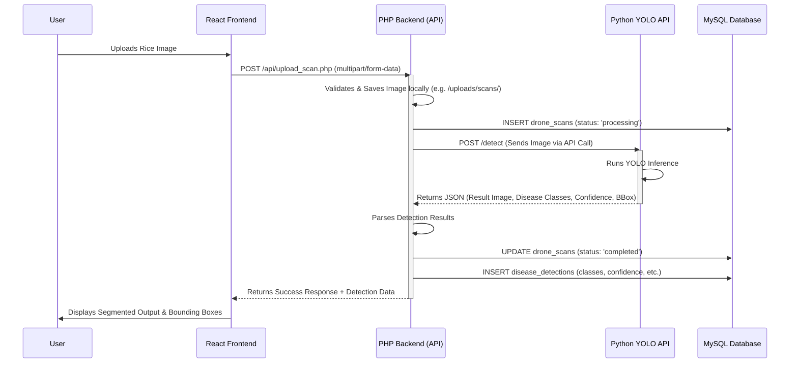

# RiceGuard YOLO Model Integration Architecture

This document outlines the planned future architecture for integrating a Python-based YOLO computer vision model into the RiceGuard AI platform for automatic rice disease detection and image segmentation.

## System Workflow

## Component Responsibilities

### 1. React Frontend (`frontend/`)
- Provides an intuitive interface for farmers/admins to upload field images or drone scans.
- Handles file selection, previews, and form submission to the PHP backend.
- Renders the resulting segmented image, bounding boxes, and extracted disease data seamlessly without requiring page reloads.

### 2. PHP Backend (`api/upload_scan.php`)
- Acts as the main orchestrator and security layer.
- Handles the initial file upload, ensuring valid image formats.
- Creates initial tracking records in the MySQL database.
- Makes synchronous (or asynchronous) HTTP/CURL requests to the external Python YOLO service.
- Receives the JSON response from Python, processes the metadata, and updates the database records.

### 3. Python YOLO API (Future Microservice)
- A standalone microservice (likely built with FastAPI or Flask).
- Loads the pre-trained YOLO model (e.g., YOLOv8).
- Accepts the image payload, runs the inference.
- Generates segmentation masks or bounding box coordinates.
- Returns a structured JSON payload containing the detected classes, confidence scores, and path to the generated segmented image output.

## Recommended Next Steps for Implementation
1. **Develop the Python Microservice**: Create a simple FastAPI endpoint `POST /detect` that loads your trained `.pt` weights and returns mock data initially.
2. **Refactor `upload_scan.php`**: Modify the current `upload_scan.php` (which currently uses `mock_ai`) to actually execute a CURL request to your local Python API when an image is uploaded.
3. **Frontend Integration**: Ensure the React frontend dynamically parses the returned BBox and segmented image URLs from the PHP response.
